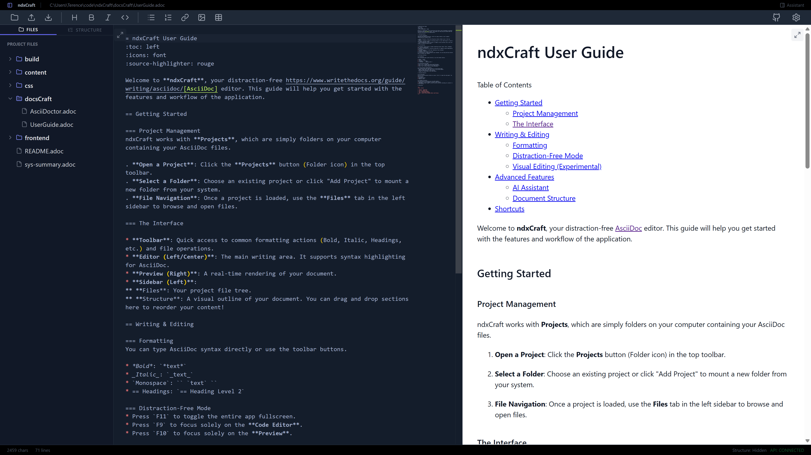

= ndxCraft
:toc: macro
:toc-title:
:icons: font
:idprefix:
:idseparator: -
:sectanchors:
:source-highlighter: rouge

image:https://img.shields.io/badge/Built%20with-Wails-red[link="https://wails.io"]
image:https://img.shields.io/badge/Frontend-React-blue[link="https://react.dev"]
image:https://img.shields.io/badge/Language-AsciiDoc-orange[link="https://asciidoc.org"]

**ndxCraft** is a modern, distraction-free AsciiDoc editor designed for technical writers and documentation enthusiasts. Built with the power of Go (Wails) and the flexibility of React, it provides a seamless writing experience with real-time previewing and powerful project management tools.

toc::[]

== Features

=== 🚀 Core Experience
* **Real-time Preview**: See your AsciiDoc render instantly as you type.
* **Distraction-Free Writing**:
** **Focus Mode**: Collapse sidebars to focus purely on your content.
** **Fullscreen Modes**: Dedicated fullscreen modes for both Code and Visual editors (`F9` / `F10`).
* **Modern UI**: A sleek, dark-themed interface built with Tailwind CSS and Shadcn UI.

=== 📂 Project Management
* **Project List**: Easily manage multiple documentation projects. Mount folders from your host system and switch between them instantly.
* **File Explorer**: Integrated file tree for navigating your project structure.
* **GitHub Integration**: Open your current project directly in GitHub Desktop with a single click.

=== 🧠 AI Assistance
* **Smart Writing Companion**: Integrated AI assistant (powered by Gemini) to help draft content, fix grammar, or brainstorm ideas.
* **Context Aware**: The assistant understands your current document context.

=== 🛠️ Advanced Tools
* **Document Structure**: Visual outline view (AST or Block mode) to navigate and reorder large documents via drag-and-drop.
* **Custom CSS**: Bring your own stylesheets to customize the preview rendering.
* **Shadow Save**: Automatic shadow backups protect your work from accidental loss or crashes.

== Installation

=== Prerequisites
* **Go**: v1.21 or newer
* **Node.js**: v18 or newer
* **Wails**: Install via `go install github.com/wailsapp/wails/v2/cmd/wails@latest`

=== Build from Source

.Clone the repository
[source,bash]
----
git clone https://github.com/yourusername/ndxCraft.git
cd ndxCraft
----

.Install frontend dependencies
[source,bash]
----
cd frontend
npm install
cd ..
----

.Run in Development Mode
[source,bash]
----
wails dev
----

.Build for Production
[source,bash]
----
wails build
----

== Keyboard Shortcuts

|===
| Key | Action

| `F11` | Toggle App Fullscreen
| `F9` | Toggle Code Editor Fullscreen
| `F10` | Toggle Preview Fullscreen
| `Tab` | Switch focus between Editor and Preview
| `Ctrl+S` | Save File
|===

== Technology Stack

* **Backend**: Go (Wails framework)
* **Frontend**: React, TypeScript, Vite
* **Styling**: Tailwind CSS, Shadcn UI
* **Editor**: Monaco Editor (via React wrapper)
* **Database**: SQLite (modernc.org/sqlite)

== License

This project is licensed under the MIT License.
